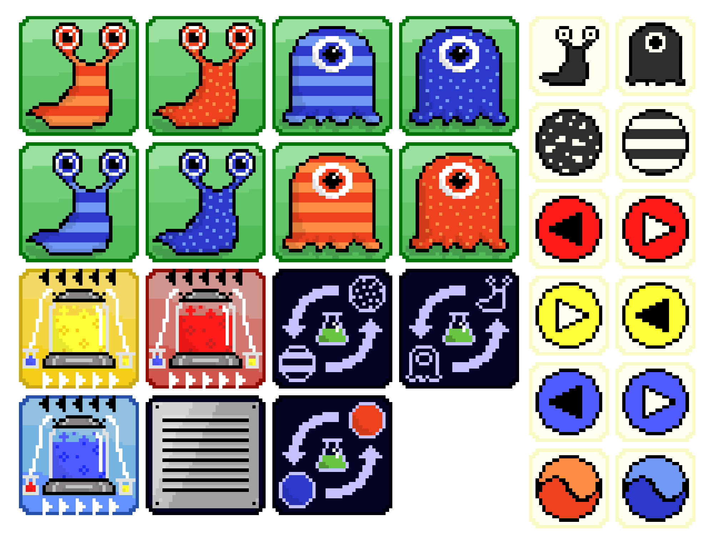

# softdev2020

## Szoftverfejlesztés (MSc) gyakorlat beadandó feladat

### Készítők:

* **Nagy Dániel Zoltán** (*Backend, grafika*)

* **Soós Tamás** (*Frontend*)

### Leírás:

A féléves beadandó feladatnak egy online játék elkészítését választottuk. A játék a [Panic Lab](https://www.gemklub.hu/panic-lab-441) gyorsasági kártyajátékon alapszik. A szabály és a játékmenet teljesen megegyezik az eredetivel. Egy online felületet szeretnénk biztosítani a játékhoz, melyben a játékosok szobákba csoportosulva játszhatnak egymással.

A játék főoldalát meglátogatva a leendő játékosoknak lehetőségük van új privát szobák létrehozására. Új szoba létrehozása esetén egy generált linken keresztül látogatható meg a szoba. A kapott linket a szoba készítője az oldalon kívül tetszőleges közösségi felületeken továbbíthatja ismerőseinek, hogy azok is tudjanak csatlakozni a játékhoz. Az eredeti játékot maximum 10 fő játszhatja egyszerre, így az egyes szobák befogadóképessége is 10 főre korlátozódik.

A játék indulásakor a kártyák véletlenszerűen megkeverednek, majd a játék élettartama alatt nem változnak.
Az első körben a szoba készítője élhet a dobás jogával. Dobás után a játékosok feladata, hogy a 4 db kocka alapján megkeressék a nyerő lapot. Az nyeri a kört és a tokent, aki leggyorsabban eltalálta a lapot. (A hibásan leadott tippért 1 tokent kell beadni a játékosnak). A következő körben a dobás joga a nyertest illeti. Amennyiben nem születik nyertes, úgy az utolsó nyertes dobhat.

A játék időtartamát és a körök számát a szoba készítője adhatja meg.
Az utolsó kör végén egy listát láthatnak a játékosok a játék végeredményéről. A listán a szoba játékosai szerepelnek, a megszerzett tokenek szerinti csökkenő sorrendben.
Az eredményhirdetés után a szoba megszűnik, tovább már nem látogatható.

### Az eredeti társasjáték hivatalos ismertetője:

> *Az amőbák elszabadultak a laboratóriumban, és most szétszéledtek mindenfelé. Gyorsan el kell kapnod őket! A speciális dobókockák megmondják, hogy melyik laboratóriumból tűnt el az amőba és milyen amőbát is kell pontosan keresnünk, akinek először ez sikerül, azé a pont. De vigyázz, az amőbák menekülnek, szellőzőkben bujkálnak, mutálódnak, nem lesz könnyű dolgod velük! Biztos te fogsz nyerni, ha gyors az észjárásod és fürge vagy.*

